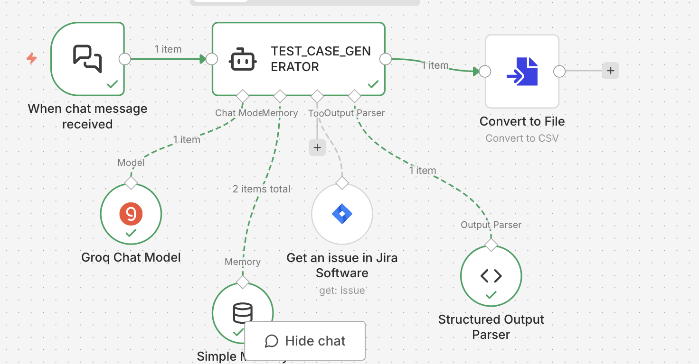

# N8N Jira Test Case Generator

This project contains an n8n flow designed to automatically generate high-quality QA test cases from a Jira issue ID using a LangChain agent and an LLM.

## Overview

The flow is triggered via a chat message containing a Jira Issue ID. It fetches the issue details from Jira Software and uses a Groq-powered Chat Model to act as a Senior QA Engineer. The agent generates structured test cases based strictly on the issue's description, acceptance criteria, and business rules without hallucinating details. Finally, it parses the output into a structured format and converts it to a file.

## Flow Diagram

## Features

- **Chat Trigger**: Initiates the flow when a user sends a Jira Issue ID.
- **Jira Integration**: Retrieves complete issue details directly from your Jira Cloud environment using the n8n Jira tool.
- **LLM Powered Generation**: Uses the `openai/gpt-oss-20b` Groq model for fast and accurate test case generation.
- **Strict Constraints**: Assures test cases are generated *only* from the provided requirements. Identifies missing information with "Needs clarification".
- **Structured Output**: Outputs test cases containing:
  - Test ID
  - Description
  - Pre-conditions
  - Steps
  - Expected Result
  - Priority
- **File Conversion**: Prepares the generated test cases into a standardized file format.

## Setup Instructions

1. **Import the Flow**: Download the `TEST_CASE_GENERATOR.json` file and import it into your n8n workspace.
2. **Configure Credentials**:
   - Provide your **Groq API key** in the Groq Chat Model node.
   - Supply your **Jira SW Cloud account** credentials in the Jira Tool node to allow fetching issues.
3. **Execute**: Open the chat interface in the n8n execution view, type a valid Jira ID (e.g., `PROJ-123`), and prompt the agent to generate your test cases.
